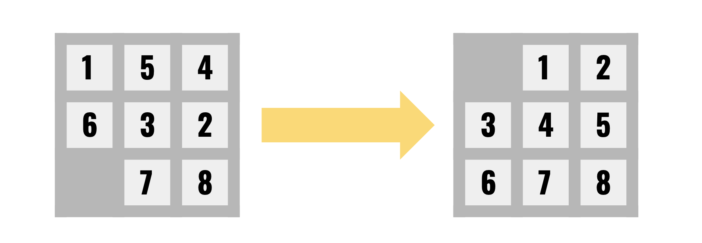

# 8-Puzzle Solver

This project implements a solver for the 8-Puzzle Problem using the A* search
algorithm, enabling use of two different heuristics.

The heuristic #2 implementation is able to find solutions of great depth (number
 of steps) -- e.g. 23 steps -- very quickly.

The objective of the 8-Puzzle Problem is to find a step-by-step solution to a
puzzle with 8 numbers, where the only movements allowed are single permutations
between neighboring elements to the empty space (represented as 0). For example,



A solution to the 8-Puzzle Problem is of the form

```
0 1 2
3 4 5
6 7 8
```

where 0 represents the empty tile.

## Running the solver

This project was tested on a Python 3.8 environment. In order to run the solver,
type in the command

```python solve_puzzle.py```

Upon entry in the command line interface, you may choose between two modes of
operation: solving a puzzle drawn at random or a puzzle input from the command
line of the format (for instance):

```
5 4 1
7 6 3
8 2 0
```

After the puzzle is displayed, it is possible to choose between two search
heuristics to implement in the A* search:

```
h1 = Number of Misplaced Tiles
h2 = Manhattan Distance
```

The program then outputs (if the puzzle is a solvable puzzle) each step to solve
the puzzle.

The program also displays the final search cost (number of nodes needed) to
solve the puzzle and the time in seconds it took to solve it.

Sample program outputs are available in the `/output` folder.


### Heuristic - Number of Misplaced Tiles

This heuristic counts the number of tiles that are not in the original place
that they should be.

### Heuristic - Manhattan Distance

This heuristic sums the taxicab distances of the tiles from their location to
the original place they should be.


## Output Example

More outputs (of greater depth) are found in `/output`.

```
CS 4200 Project 1
8-Puzzle Solver
--------------------------

Select option:
[1] Solve random puzzle
[2] Solve puzzle from input
[3] Exit
2

Type in your puzzle in 3 lines:
1 4 2
3 7 5
0 6 8

Puzzle:
1 4 2
3 7 5
0 6 8

Select heuristic to solve:
[1] h1 = Number of Misplaced Tiles
[2] h2 = Manhattan Distance
2

Solution Found

Initial state:
1 4 2
3 7 5
0 6 8

Step #1: move left
1 4 2
3 7 5
6 0 8

Step #2: move down
1 4 2
3 0 5
6 7 8

Step #3: move down
1 0 2
3 4 5
6 7 8

Step #4: move right
0 1 2
3 4 5
6 7 8

Solution Depth: 4
Search Cost for heuristic h2: 10 nodes
Search Time: 0.0017 seconds
--------------------------
```
